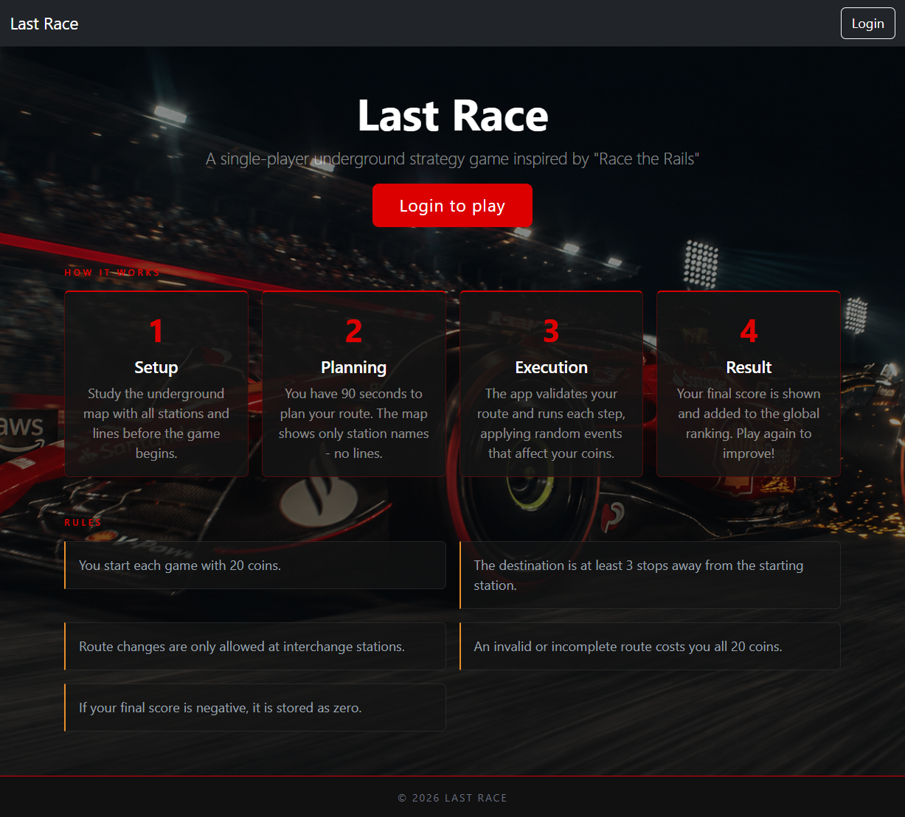
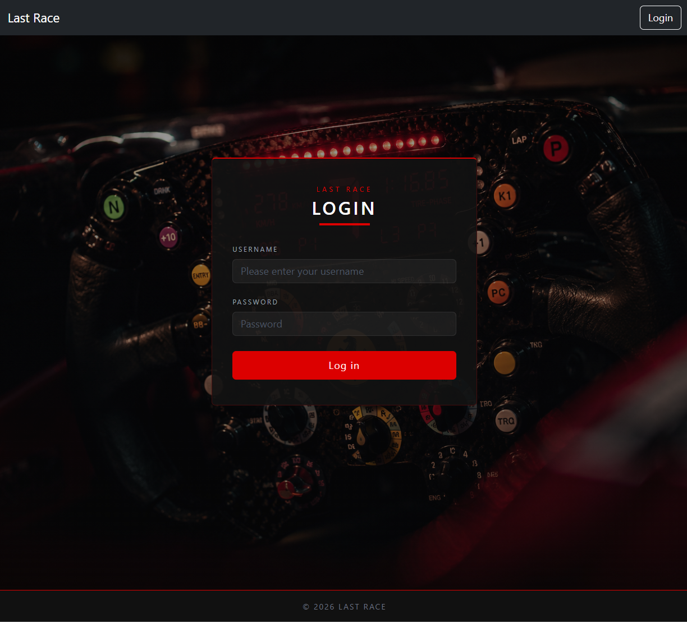
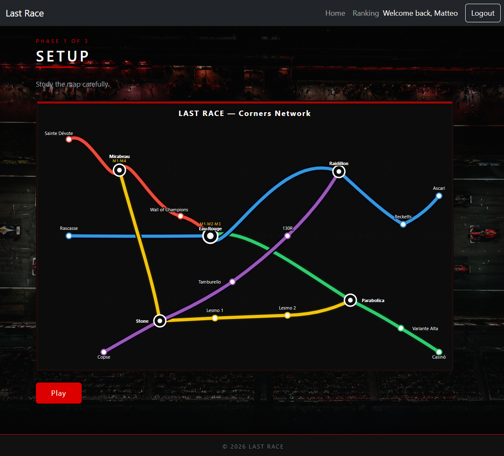
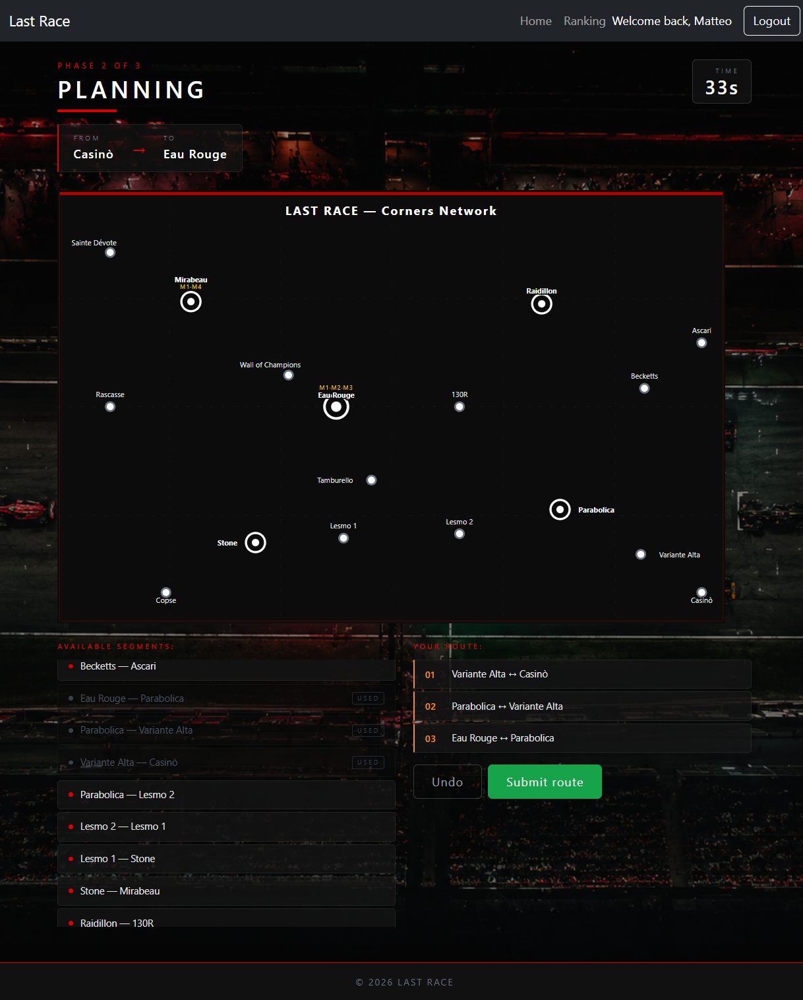
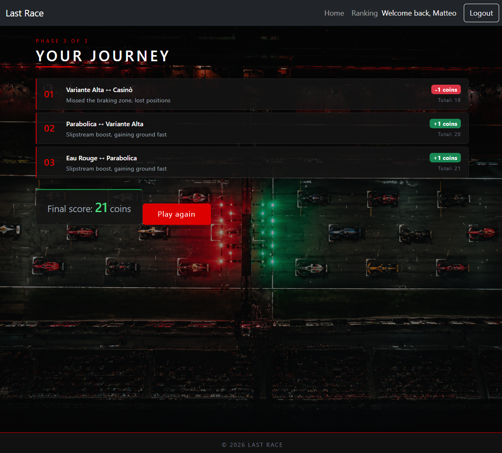
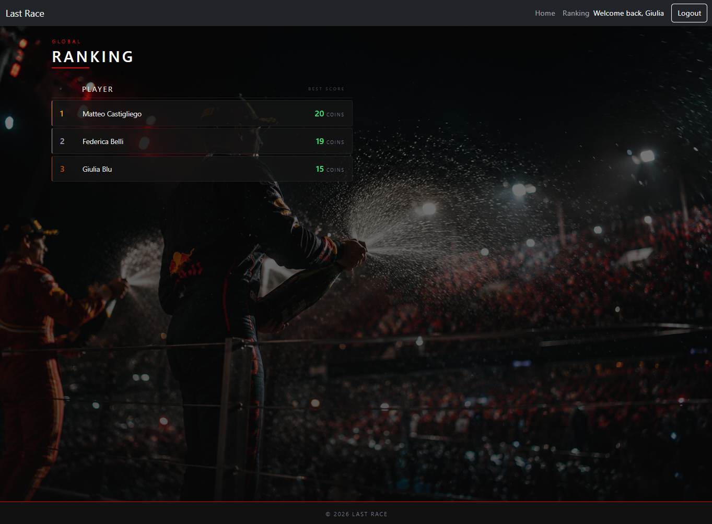
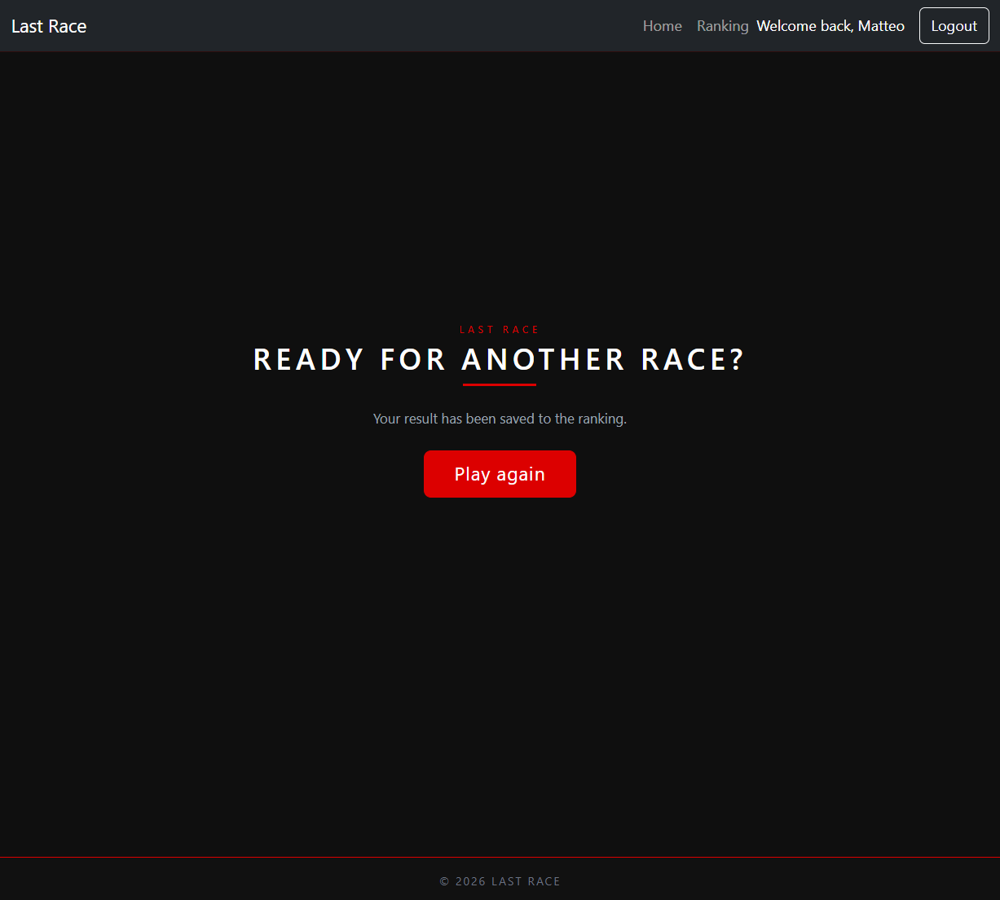

# Exam #1: "LAST RACE"
---
## Student: s364209 CASTIGLIEGO MATTEO FRANCESCO 
---

## React Client Application Routes
---

- Route `/`: homepage with game instructions if not authenticated plus login button. If authenticated you are linked to `/game`
- Route `/play`: page shown when a game ends to allow the user to start a new one
- Route `/login`: page that contains the login form, redirect to `/game` after authentication, otherwise to `/login`
- Route `/logout`: logs out the current user redirecting him to `/`
- Route `/game`: core page that contains all phases of the game, login required
- Route `/ranking`: shows general ranking of authenticated users, login required

## API Server
---

- POST `/api/sessions`
  - request body: `{ username, password }`
  - response body: `{ id, username, name }` or 401 error 
- GET `/api/sessions/current`
  - response body: `{ id, username, name }` if authenticated, 401 if not
- DELETE `/api/sessions/current`
  - response: 200, logs out the current user
- GET `/api/segments`
  - login required
  - response body: array of `{ from, fromName, to, toName }`, represents pairs of ajacent stations along all lines
- GET `/api/ranking`
  - login required
  - response body: array of `{ name, surname, best_score }` ordered by best score descending
- POST `/api/game`
  - login required
  - response body: `{ gameId, startStation: { id, name }, endStation: { id, name } }` - creates a new game with random from/to station
- POST `/api/game/:id/execute`
  - login required
  - URL parameter: `id` — the id of the game
  - request body: `{ segments: [{ from: stationId, to: stationId }, ...] }` - ordered list of segments chosen by the user
  - response body: `{ valid, steps: [{ from, to, event, coinsChange, total }], finalScore }` - validates the route, assigns random events to each segment, saves and returns the final score; starts with 20 coins, score floored at 0

## Database Tables
---

- Table `user` - contains registered users with their own hash password and salt for authentication (id, name, surname, username, password, salt)
- Table `station` - contains the list of stations in the game (id, name)
- Table `line` - contains the list of metro lines (id, name, color) 
- Table `event` - contains all the events that can occur during the game (id, description, coins)
- Table `game` - stores all games played by registered users with relative from/to stations and coins gained/lost (id, id_user, id_station_start, id_station_end, score)
- Table `stations_of_a_line` - contains for each line the list of stations along that line with their relative position; elements are ordered by id_line and for each line the order depends by the position; useful to find connections (id_line, id_station, position)

## Main React Components
---
- `PublicPage` (in `PublicPage.jsx`): homepage where are placed all game instructions for unauthenticated users and login button.
- `GamePage` (in `GamePage.jsx`): general manager of the game where all phases are managed.
- `SetupPhase` (in `SetupPhase.jsx`): page where is placed the entire map and the 'play' button.
- `PlanningPhase` (in `PlanningPhase.jsx`): in this page there is the map with stations, list of available segments, list of segments selected by the user and the 'submit route' button.
- `ResultPhase` (in `ResultPhase.jsx`): this page is shown when the timer ends or when a route is submitted and shows the result of the game, 0 if fail or all paths in case of success with relative events and coins gained or lost. There is also a button to show the path step by step.
- `RankingPage` (in `RankingPage.jsx`): displays the general ranking of registered users with their name and best score.

## Screenshot
---

## Users Credentials
---

- __matteocastigliego__, matteo (two games played)
- __federicabelli__, federica (three games played)
- __giuliablu__, giulia (one game played)
- __mariorossi__, mario (no game played)
- __antoniaverdi__, antonia (no game played)

## Use of AI Tools
---
I used Claude for CSS, style of pages, verify that all specifications were satisfied, implementation of Network Map and optimize some line of code for the validation of the route selected by the user.
I used also ChatGPT for generation of images.
